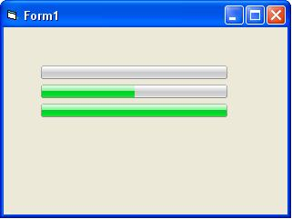



## Vista Style Progressbar

### Description

This is a Vista style progress bar i built for one of my programs, it has min,max and value settings and looks clean and works well with no known bugs
 
### More Info
 

             |
---                |---
**Submitted On**   |2007-05-14 00:30:02
**By**             |[Lloyd Pharazyn](https://github.com/Planet-Source-Code/PSCIndex/blob/master/ByAuthor/lloyd-pharazyn.md)
**Level**          |Beginner
**User Rating**    |4.6 (23 globes from 5 users)
**Compatibility**  |VB 3\.0, VB 4\.0 \(16\-bit\), VB 4\.0 \(32\-bit\), VB 5\.0, VB 6\.0
**Category**       |[Custom Controls/ Forms/  Menus](https://github.com/Planet-Source-Code/PSCIndex/blob/master/ByCategory/custom-controls-forms-menus__1-4.md)
**World**          |[Visual Basic](https://github.com/Planet-Source-Code/PSCIndex/blob/master/ByWorld/visual-basic.md)
**Archive File**   |[Vista\_Styl2065525142007\.zip](https://github.com/Planet-Source-Code/lloyd-pharazyn-vista-style-progressbar__1-68587/archive/master.zip)

